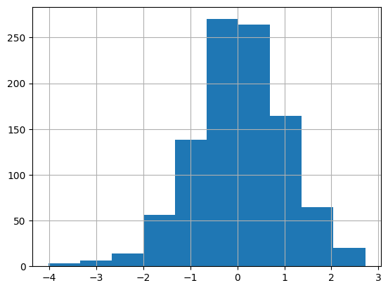

# Проект посвящённый визуализации статистических методов и A/B тестирования

## Описание проекта
Проект демонстрирует этапы анализа данных с помощью статистических методов, так же в проект включено применение A/B тестирования для сгенерированных и несгенерированных выборок данных. В основе созданного репозитория лежит курс видеолекций: https://www.youtube.com/playlist?list=PLQJ7ptkRY-xbHLLI66KdscKp_FJt0FsIi

## Интерпритация уроков

В ходе первых уроков, мы вспоминали различные виды перменных (непрерывные / категориальные). Также мы повторили агрегационные функции такие как (.count(), .sum(), .mode(), .median()) 

Далее нами были рассмотрены различные Генераторы а так же метод Монте-Карло

Равномерное распредление:

Нормальное распределение:

Пуасоновское распредление:

Логнормальное распределение:

Распределение Парето:

Нами была изучена разница между графиками PDF(PMF) | CDF. Оба метода применены на сгенерированном равномерном распределении.

ecdf график:

PDF(PMF) график:

Далее мы рассмотрели ЗБЧ и ЦПТ для различных распределений

Пример ЗБЧ для нормального распределения

Пример ЦПТ для выборки из 1000 элементов

В заключительных уроках, нами было рассмотренно проведение A/B тестирования, для пропрорций и непрерывных перменных.

**Используемые тесты**

t-test

Mann Whitney Test

(https://leansigmacorporation.com/mann-whitney-testing-with-minitab/)

Более подробно о ходе выполнения работы можно посмотреть внутри блокнота

## Структура репозитория
- **math-statistics.ipynb**: Jupyter Notebook с кодом.
- **requirements.txt**: Файл со списком зависимостей, необходимых для запуска кода.

## Как использовать проект
1. Склонируйте репозиторий на свой компьютер.
2. Установите необходимые зависимости, указанные в файле `requirements.txt`.
3. Запустите Jupyter notebook `math-statistics.ipynb`, следуя инструкции в нём.

## Контактная информация
Если у вас есть вопросы или предложения по улучшению проекта, свяжитесь со мной:
- Email: maximgoltsov@gmail.com
